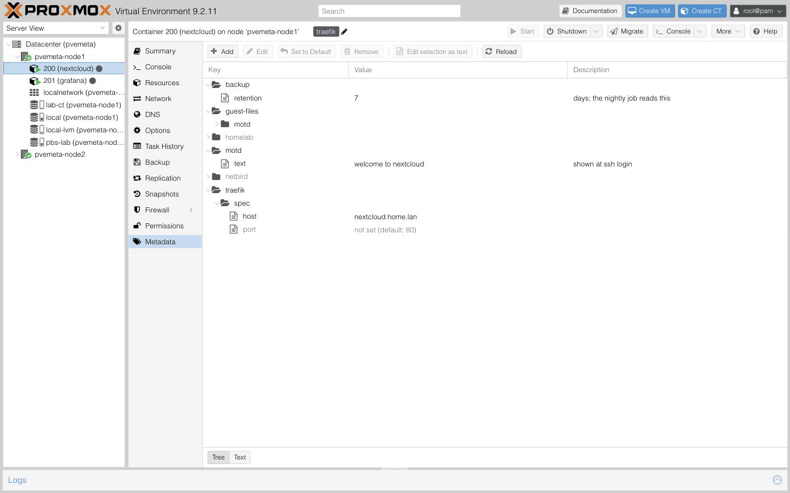
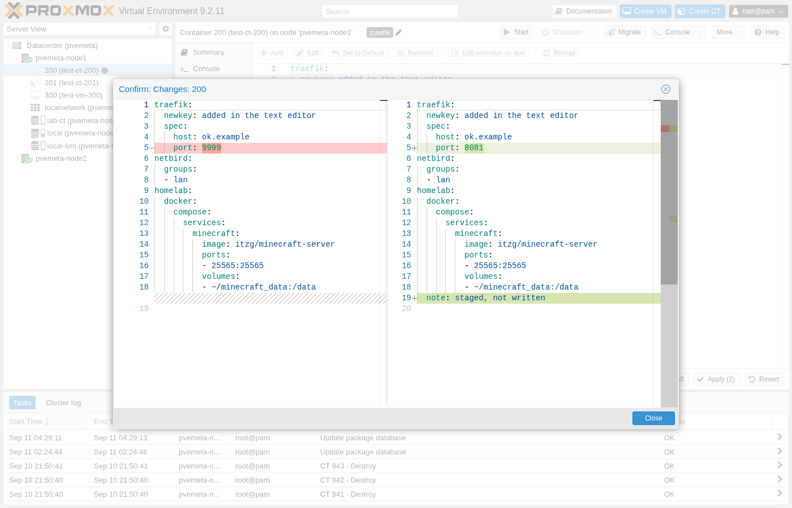
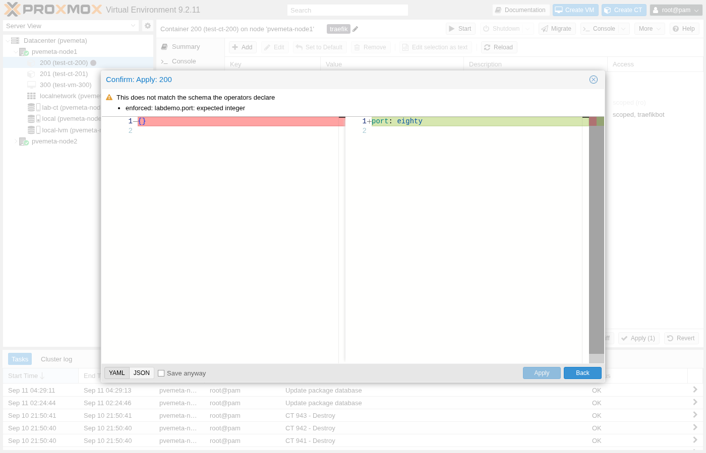
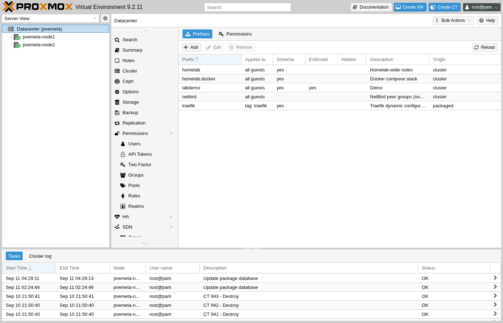
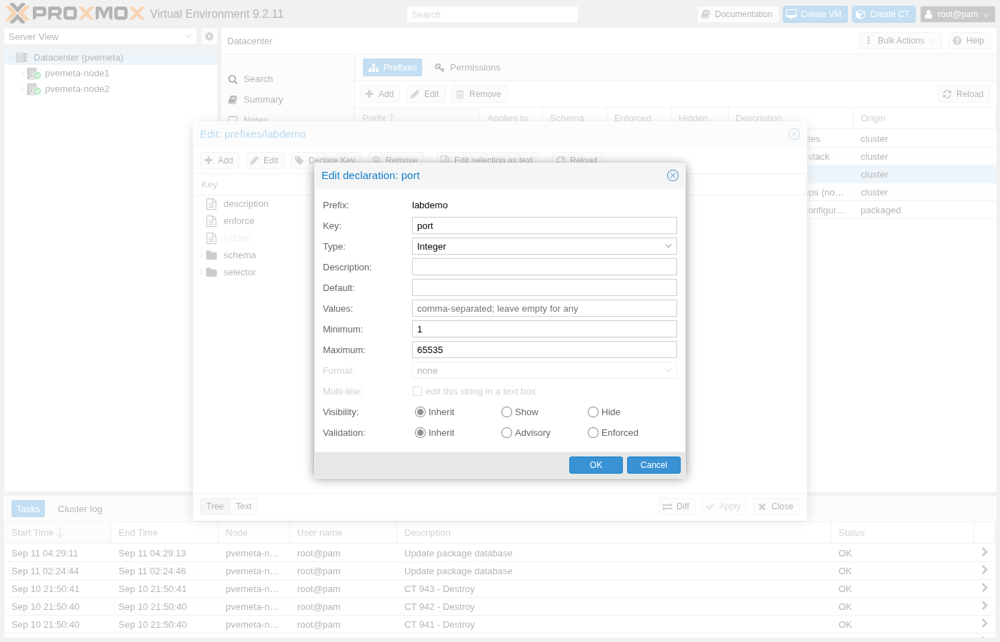

# pve-meta

Structured metadata for Proxmox VE guests. One YAML document per VM or container,
stored in `/etc/pve` and replicated with the cluster, with a native API, an editor tab
in the PVE UI, and a CLI for hook scripts. Optionally, a schema can describe part of a
document and an API token can be scoped to part of it.

<picture>
  <source media="(prefers-color-scheme: dark)" srcset="ui-extjs/docs/screenshots/readme-tree-dark.png">
  
</picture>

## Why

PVE has no place for structured data about a guest. Tags are flat labels, the Notes
field is free text, and every tool that needs to know something about a VM keeps its
own inventory that drifts. Docker solved this for containers with labels; pve-meta is
labels for PVE guests, with structure.

The store holds **intent**. Operators read it and act: a Traefik plugin that builds
routes from `traefik.spec`, a DNS sync that reads `dns.records`, a backup policy that
reads `backup.retention`. Several of them share one document safely, because each
declares the prefix it owns, can attach a schema to it, and can be given a token that
sees and writes nothing else. The document is removed when the guest is destroyed,
cleared when its vmid is reused, and snapshotted and rolled back with the guest;
migration needs nothing, since the file is cluster-wide. A backup carries it in the
archive's copy of the guest's notes and a restore reads it back; clone does not copy it.

## What it looks like

```yaml
# /etc/pve/meta/105.yaml
traefik:
  spec: { host: web.example, port: 8080 }
backup:
  retention: 7
  retention__: days; read by the nightly job     # a comment key: a note about its sibling
```

That is all a document is, and it works with nothing else in place: no prefix, no
schema, no permission file. A comment key is for whoever edits the document: the tab
shows it as the row's description, and a read leaves it out unless it asks for
`comments`. Any key, any depth, edited in the tab or written by a
script. Everything below is opt-in, layered on where you want a guarantee.

A **prefix** file says what a prefix is (the file name is the prefix). Declare one to
give the editor typed rows and defaults for that part of a document, or to say which
guests it belongs on; add `enforce: true` only where a broken write should be refused,
and even then `force=1` (the editor's "Save anyway") stores it:

```yaml
# /etc/pve/meta.d/prefixes/traefik.yaml
description: Traefik dynamic configuration
selector: { tag: traefik }        # which guests it reaches: { all: true } or a tag
enforce: true                     # refuse writes that break the schema (force=1 overrides)
schema:                           # PVE::JSONSchema dialect; drives the editor's rows
  type: object
  properties:
    spec:
      type: object
      properties:
        host: { type: string, format: dns-name }
        port: { type: integer, minimum: 1, maximum: 65535, default: 80 }
```

A file of the same name in `/etc/pve/nodes/<node>/meta.d/prefixes/` overrides it for the
guests on that node.

A **permission** file gives a token a prefix, on the guests its selector matches, so
one document can be shared by several tools that cannot step on each other. Cluster-only,
so a package can declare a prefix but never grant itself access:

```yaml
# /etc/pve/meta.d/permissions/traefik.yaml
authid: svc@pve!traefik
rules:
  - { prefix: traefik, mode: rw, selector: { tag: traefik } }
```

Full read of a guest's document is `VM.Audit`, full write is `VM.Config.Options`; a
rule adds one prefix on the guests its selector matches. A write is authorized by what
it changes, not by the view it names.

## Install

```sh
curl -fsSL https://apt.arki05.com/pubkey.asc \
    | gpg --dearmor -o /etc/apt/keyrings/arki05.gpg
echo "deb [signed-by=/etc/apt/keyrings/arki05.gpg] https://apt.arki05.com trixie main" \
    > /etc/apt/sources.list.d/arki05.list
apt update && apt install pve-meta
```

amd64 and arm64, PVE 9 on Debian trixie. Three packages come along: `pve-ext` (the
extension layer that mounts the API module and the tab, its own package),
`libpve-meta-rs-perl` (the Rust core, as a Perl module) and `pve-meta` itself. The
install applies three managed patches, one file each in `libpve-guest-common-perl`,
`qemu-server` and `pve-container`, for the lifecycle and backup hooks, verified with
`perl -c` and re-applied when those packages are upgraded. Removing `pve-meta` restores
the pristine files and leaves the documents alone.

## Use

**In the UI.** Every LXC and QEMU guest gets a **Metadata** tab: one tree of the
document, declared-but-unset keys greyed with their defaults, edits staged and applied
together, a Text mode with Monaco, and a diff before you commit. The Datacenter panel's
Metadata tab lists the prefixes and permissions and edits them in the same editor.

| Text mode with the diff | Save anyway, when a schema objects |
|---|---|
| <picture><source media="(prefers-color-scheme: dark)" srcset="ui-extjs/docs/screenshots/readme-text-diff-dark.png"></picture> | <picture><source media="(prefers-color-scheme: dark)" srcset="ui-extjs/docs/screenshots/readme-save-anyway-dark.png"></picture> |

| Prefixes on the Datacenter panel | Editing a declaration |
|---|---|
| <picture><source media="(prefers-color-scheme: dark)" srcset="ui-extjs/docs/screenshots/readme-prefixes-dark.png"></picture> | <picture><source media="(prefers-color-scheme: dark)" srcset="ui-extjs/docs/screenshots/readme-declare-key-dark.png"></picture> |

**From a script on the node**, no token, no pveproxy, works during boot:

```sh
host=$(pve-meta get 105 traefik.spec.host)              # a scalar prints bare; exit 2 = not there
pve-meta get 105 traefik                                 # structure prints YAML
pve-meta set 105 traefik --data '{"spec":{"host":"web.example"}}'
pve-meta merge 105 backup --text 'retention: 14'
pve-meta delete 105 traefik.spec.port
```

`examples/maintenance-hook.pl` refuses to start a guest whose metadata says it is under
maintenance, in twenty lines.

**Over the API**, `/api2/json/meta`, with an ordinary PVE ticket or token:

```sh
pvesh get /meta/guests --has traefik                     # every guest with that prefix
pvesh get /meta/guests/105 --view traefik --format yaml  # one subtree, exact types
pvesh set /meta/guests/105 --view traefik --data '{"spec":{"port":8081}}' --digest <d>
pvesh get /meta/version --id 105                          # poll this; it moves when anything changes
```

Every write leaves one syslog line tagged `pve-meta audit:`.

**Into a container**, with the optional `pve-meta-publish` package: a `publish` entry
names a view of the container's own document and a path inside it, and a daemon on each
node writes it there, as YAML or JSON without its comment keys or as verbatim text, on
change, on container start and against drift. One way; a file edited inside the container is left alone unless the
entry says `overwrite`. Writing `publish` is root in that container.

```yaml
publish:
  swap: { view: llm.swap, path: /etc/llama-swap/config.yaml }
```

> [!WARNING]
> **With `pve-meta-publish` installed, write access to `publish` means root inside that
> container.** It writes any file, with any owner and mode, as root. Gate it like root:
> restrict `VM.Config.Options` on containers, and don't grant `publish` through permission
> rules to anyone you wouldn't give root. It guards against accidents, not against users
> inside the container.

## Where things are

| | |
|---|---|
| [`docs/DESIGN.md`](docs/DESIGN.md) | the specification: what is true of the code |
| [`docs/decisions/`](docs/decisions/README.md) | why, one record per decision |
| [`docs/BUILD.md`](docs/BUILD.md), [`docs/DISTRIBUTION.md`](docs/DISTRIBUTION.md) | building, releasing, the apt repository |
| `crates/pve-meta-core` | every rule, in Rust; the API calls it through perlmod, the editor runs it as wasm |
| `perl/`, `bin/`, `ui-extjs/`, `pve-ext/` | the API module, the CLI, the editor, the extension layer |

AGPL-3.0-or-later.
